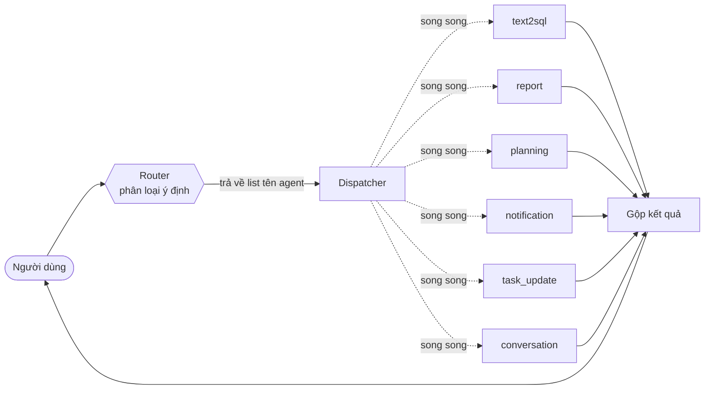
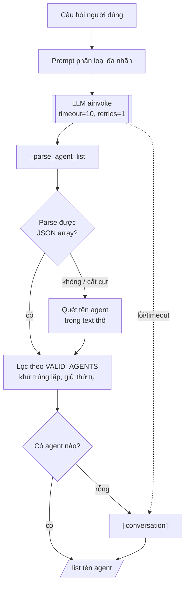
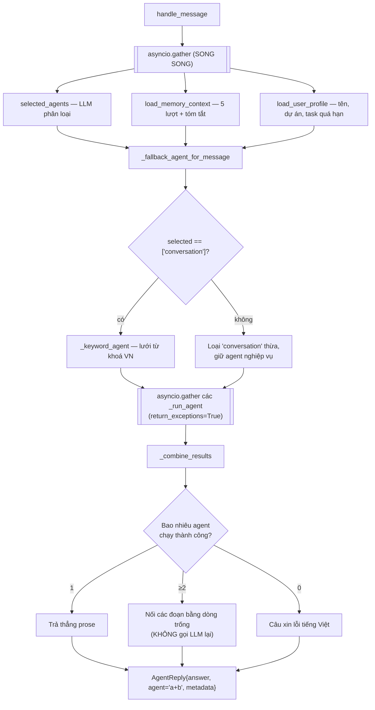
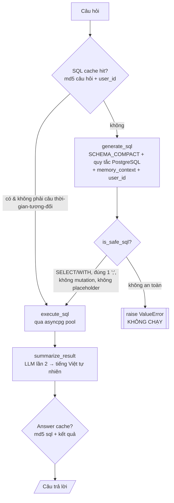
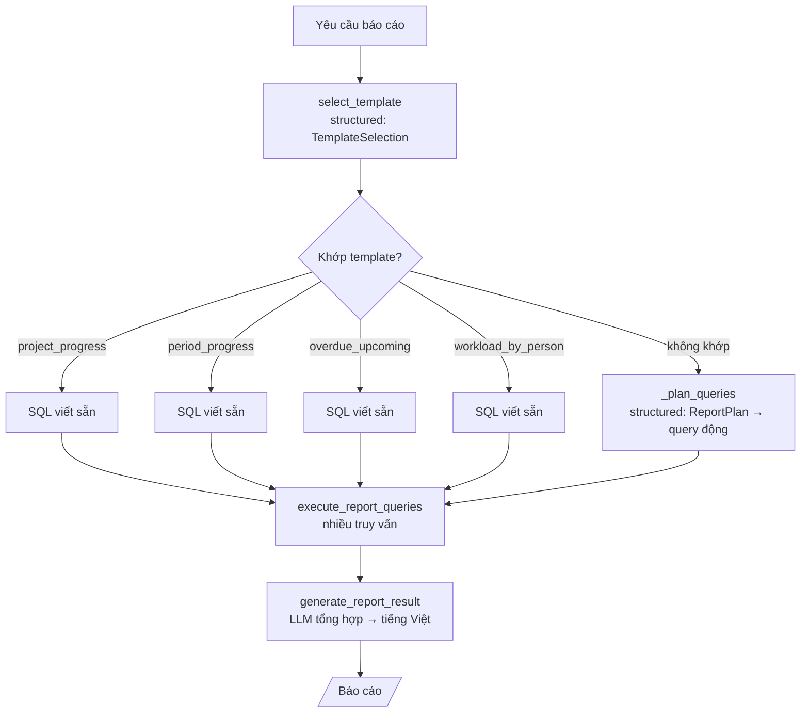
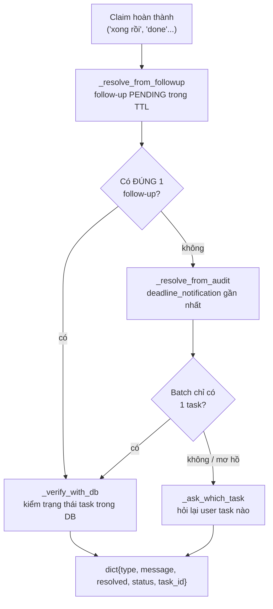
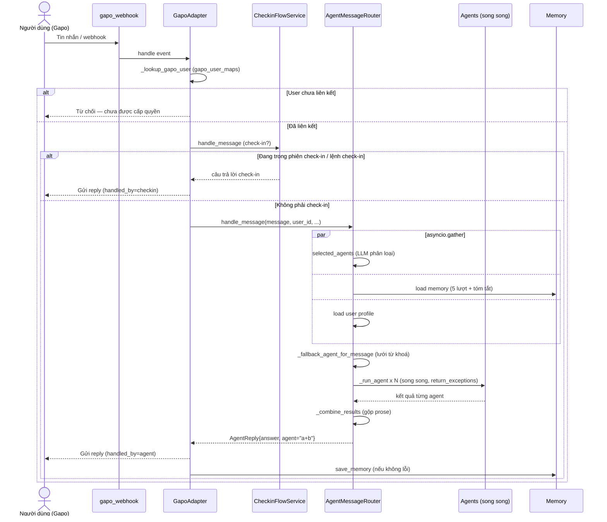
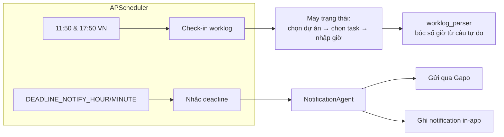

# AI Agent — PM-Bot

Trợ lý AI cho hệ thống quản lý dự án (Project Management). Người dùng trò chuyện bằng **tiếng Việt** qua Gapo (hoặc HTTP API), và bot trả lời các câu hỏi về dự án, task, worklog, tiến độ — đồng thời tự động nhắc deadline, xác minh hoàn thành công việc, và thu thập check-in hằng ngày.

Tài liệu này giải thích **kiến trúc**, **tại sao chọn cách làm đó**, **công nghệ sử dụng**, và **luồng dữ liệu chi tiết** từ một tin nhắn người dùng đến câu trả lời. Các sơ đồ dưới đây dùng [Mermaid](https://mermaid.js.org/) — GitHub render trực tiếp.

---

## 1. Tổng quan thiết kế: tại sao là "multi-agent router"?

Một câu hỏi PM có thể rất khác nhau về bản chất:

| Câu hỏi của người dùng | Cần xử lý kiểu gì | Agent |
|---|---|---|
| "Có bao nhiêu task trong dự án CRM?" | Truy vấn DB chính xác | `text2sql` |
| "Báo cáo tiến độ tuần này" | Tổng hợp nhiều truy vấn + diễn giải | `report` |
| "Giúp tôi lập kế hoạch dự án X" | Sinh nội dung có cấu trúc | `planning` |
| "Tạo thông báo nhắc deadline thứ 6" | Sinh nội dung thông báo | `notification` |
| "Tôi update task ABC rồi nhé" | Xác minh & cập nhật trạng thái task | `task_update` |
| "Chào bạn" | Hội thoại tự nhiên | `conversation` |

Thay vì nhồi tất cả vào **một** prompt khổng lồ (vừa chậm, vừa khó kiểm soát, vừa dễ "ảo giác"), hệ thống chia thành **các agent chuyên biệt**, mỗi agent có prompt + logic riêng. Một **router** đứng trước phân loại ý định và chọn **một hoặc nhiều** agent phù hợp; nếu chọn nhiều, chúng chạy **song song** rồi gộp kết quả.



**Lợi ích của hướng này:**
- **Prompt nhỏ, tập trung** → chất lượng cao hơn, ít lệch hơn so với một prompt "vạn năng".
- **Cô lập rủi ro** → agent `text2sql` có lớp kiểm tra an toàn SQL riêng; agent khác không cần.
- **Dễ test & thay thế** → mỗi agent là một class độc lập, có file test riêng trong [test/](backend/ai_agent/test/).
- **LLM-agnostic** → mọi agent (kể cả router) đọc model/endpoint từ biến môi trường, nên đổi nhà cung cấp LLM chỉ là đổi `.env`.
- **Đa nhãn (multi-label)** → một câu vừa cần dữ liệu vừa cần báo cáo có thể kích hoạt nhiều agent cùng lúc.

---

## 2. Công nghệ sử dụng & lý do

| Thành phần | Công nghệ | Tại sao |
|---|---|---|
| LLM client | **LangChain `ChatOpenAI`** (`langchain-openai`) | Giao diện OpenAI-compatible cho phép trỏ tới Google Gemini, OpenAI, hoặc bất kỳ endpoint tương thích nào chỉ bằng `base_url` + `api_key`. Không khoá vào một nhà cung cấp. |
| LLM model (hiện tại) | **Google Gemini** qua proxy `9router` (`MODEL_NAME` từ env) | Flash rẻ + nhanh, đủ tốt cho phân loại ý định và sinh SQL. Quan trọng với UX chat realtime. |
| Web framework | **FastAPI** (async) | Toàn bộ pipeline là I/O-bound (gọi LLM, query DB, gọi Gapo). Async cho phép chạy song song các bước (xem mục 6). |
| DB driver (đọc của agent) | **`asyncpg`** + connection pool | Driver PostgreSQL async nhanh nhất, dùng pool để tái sử dụng kết nối. |
| ORM (profile / memory / task verify) | **SQLAlchemy async** | Dùng cho các truy vấn có sẵn trong app (user profile, agent_memory, xác minh task). |
| Cache | **Redis** (`redis[asyncio]`) | Cache SQL đã sinh và câu trả lời đã diễn giải → tránh gọi LLM lặp cho cùng câu hỏi. |
| Lập lịch | **APScheduler** | Chạy job check-in (11:50 & 17:50 giờ VN) và nhắc deadline. |
| Validation / structured output | **Pydantic v2** | Ép LLM trả JSON đúng schema cho PlanningAgent (`ProjectPlan`) và ReportAgent (`ReportPlan`, `TemplateSelection`). |

> **Cấu hình LLM thống nhất:** router và mọi agent đều khởi tạo `ChatOpenAI` với `model=os.getenv("MODEL_NAME")`, `api_key=os.getenv("API_KEY")`, `base_url=os.getenv("BASE_URL")` — đều đi qua proxy `9router`. Không còn hard-code key/model trong code ([router.py:34-42](backend/ai_agent/router/router.py#L34-L42)).
>
> **Structured output:** dùng `with_structured_output(..., method="function_calling")` — `json_mode` fail khi đi qua proxy nên chọn function_calling.

---

## 3. Cấu trúc thư mục

```
backend/ai_agent/
├── router/                  # Tầng định tuyến & điều phối
│   ├── router.py            # PMMultiAgentRouter — phân loại ý định → list agent
│   └── message_router.py    # AgentMessageRouter — điều phối + chạy song song + gộp
│
├── text_to_sql/text2sql.py  # Text2SQLAgent — NL → SQL → kết quả → diễn giải
├── report_generator/        # ReportAgent — template-first, sinh báo cáo
├── planning/planning_agent.py  # PlanningAgent — sinh kế hoạch (structured output)
├── task_update/             # TaskVerifyAgent — xác minh "đã làm xong task X"
├── coversation/conversation.py # ConversationAgent — chào hỏi & trợ giúp [sic: thư mục viết sai chính tả]
├── notification/            # NotificationAgent — sinh nội dung nhắc nhở + in-app repo
│
├── memory/memory.py         # Bộ nhớ hội thoại + tóm tắt định kỳ
├── context/                 # Phân giải tham chiếu (pronoun/tên → entity)
├── checkin/                 # Luồng check-in worklog theo lịch
│   ├── service.py           # CheckinFlowService — chặn tin nhắn trong phiên check-in
│   ├── scheduler.py         # APScheduler trigger
│   └── worklog_parser/      # Bóc tách số giờ từ ngôn ngữ tự nhiên
│
├── prompt/prompt.py         # SCHEMA_COMPACT — schema DB dạng nén cho prompt
├── schemas.py               # Pydantic models dùng chung
└── test/                    # Unit test cho từng agent
```

---

## 4. Các agent chi tiết

### 4.1 Router — `PMMultiAgentRouter` ([router/router.py](backend/ai_agent/router/router.py))

**Nhiệm vụ:** phân loại ý định và trả về **một danh sách tên agent** (multi-label), không còn chấm điểm tin cậy hay ngưỡng.



**Cách hoạt động:**
1. Gửi 1 prompt phân loại đa nhãn tới LLM, yêu cầu trả về **một JSON array** tên danh mục ([router.py:85-102](backend/ai_agent/router/router.py#L85-L102)): ví dụ `["text2sql"]` hoặc `["report", "planning"]`.
2. **Parser chịu lỗi** (`_parse_agent_list`, [router.py:45-78](backend/ai_agent/router/router.py#L45-L78)): bóc ```` ```json ```` fence, tìm `[...]` rồi `json.loads`; nếu thất bại thì **quét tên agent** ngay trong text thô. Mọi tên ngoài `VALID_AGENTS` đều bị loại để tránh "agent ảo".
3. **Fail-fast:** `timeout=10, max_retries=1` — phân loại phải nhanh; nếu LLM lỗi/timeout thì trả list rỗng để tầng trên fallback ([router.py:116-126](backend/ai_agent/router/router.py#L116-L126)).
4. **Mặc định:** nếu không trích được agent nào → `["conversation"]` (`DEFAULT_AGENT`).

`VALID_AGENTS = {report, text2sql, planning, conversation, notification, task_update}` ([router.py:16-23](backend/ai_agent/router/router.py#L16-L23)).

### 4.2 Điều phối — `AgentMessageRouter` ([router/message_router.py](backend/ai_agent/router/message_router.py))

Đây là "bộ não" điều phối. `handle_message()` ([message_router.py:40](backend/ai_agent/router/message_router.py#L40)) là entry point của mọi tin nhắn sau khi đã qua tầng check-in.



- **Chạy song song** việc phân loại ý định, nạp memory, và nạp user profile bằng `asyncio.gather` ([message_router.py:61-66](backend/ai_agent/router/message_router.py#L61-L66)) — cả ba đều I/O-bound.
- **Fallback bằng từ khoá** ([message_router.py:140-199](backend/ai_agent/router/message_router.py#L140-L199)): chỉ kích hoạt khi LLM trả về **đúng** `["conversation"]` (tức "không chắc"). Lưới từ khoá tiếng Việt ưu tiên `task_update` → `planning` → `report` → `notification` → `text2sql`. Lưu ý `task_update` được kiểm **trước** từ khoá dữ liệu, vì câu "làm xong task X" chứa cả 'task' lẫn 'làm xong'.
- **Loại `conversation` thừa**: nếu LLM chọn nhiều agent gồm cả `conversation`, bỏ `conversation` vì agent nghiệp vụ đã tự chào + trả lời đủ ngữ cảnh.
- **Chạy mọi agent song song** với `return_exceptions=True` — lỗi 1 agent không làm hỏng cả reply ([message_router.py:87-102](backend/ai_agent/router/message_router.py#L87-L102)).
- **Gộp kết quả** (`_combine_results`, [message_router.py:201-229](backend/ai_agent/router/message_router.py#L201-L229)): bỏ agent lỗi/rỗng; 1 agent → trả thẳng; ≥2 agent → nối prose bằng dòng trống, **không** gọi LLM lần nữa và **không** thêm nhãn.
- Field `agent` của `AgentReply` là chuỗi nối bằng `+` (vd `"text2sql+report"`) để JSON-serializable cho audit.

### 4.3 Text-to-SQL — `Text2SQLAgent` ([text_to_sql/text2sql.py](backend/ai_agent/text_to_sql/text2sql.py))

Agent quan trọng và "nguy hiểm" nhất, vì nó sinh SQL chạy thẳng trên DB.



**Bước 1 — Sinh SQL** (`generate_sql`): prompt nhúng **`SCHEMA_COMPACT`** + quy tắc cú pháp PostgreSQL rất cụ thể (cấm `INTERVAL n DAY` kiểu MySQL, bắt dùng `date_trunc('week', ...)`...), kèm **ngữ cảnh hội thoại** và **user_id hiện tại** để xử lý "task của tôi".

**Bước 1.5 — Kiểm tra an toàn** (`is_safe_sql`) — lớp phòng thủ cốt lõi:
- Phải bắt đầu bằng `SELECT` hoặc `WITH`.
- Phải kết thúc bằng đúng **một** dấu `;` (chặn multi-statement injection).
- Regex chặn mọi từ khoá mutation: `INSERT|UPDATE|DELETE|DROP|ALTER|TRUNCATE|CREATE|REPLACE|MERGE|GRANT|REVOKE|VACUUM|CALL|DO`.
- Chặn placeholder `:field` chưa bind.
- Không an toàn → `raise ValueError`, **không bao giờ chạy**.

> Điểm thiết kế then chốt: LLM **chỉ được phép đọc**. Mọi câu lệnh ghi đều bị từ chối trước khi chạm DB.

**Bước 2 — Thực thi**: qua `asyncpg` pool, trả `list[dict]`.

**Bước 3 — Diễn giải** (`summarize_result`): gọi LLM lần 2 biến dòng dữ liệu thô thành câu tiếng Việt — giấu SQL/JSON, "nói ý nghĩa" (đúng hạn/trễ) chứ không chỉ đọc số.

**Caching (Redis):** SQL cache (key = `md5(câu hỏi chuẩn hoá + user_id)`, TTL `SQL_CACHE_TTL` mặc định 3600s) + Answer cache (key = `md5(sql + kết quả)`). **Bỏ cache** cho câu hỏi thời gian tương đối ("hôm nay", "tuần này", "mới nhất"...).

### 4.4 Report — `ReportAgent` ([report_generator/report_agent.py](backend/ai_agent/report_generator/report_agent.py))

**Template-first.** Dùng structured output (`TemplateSelection`, `ReportPlan`) để khớp yêu cầu với mẫu có sẵn; nếu khớp → chạy SQL viết sẵn (an toàn, nhanh, đoán trước được), nếu không → fallback sinh query động. Khác `text2sql` ở chỗ nó **chạy nhiều truy vấn** rồi tổng hợp.



### 4.5 Planning — `PlanningAgent` ([planning/planning_agent.py](backend/ai_agent/planning/planning_agent.py))

Sinh **structured output** (`ProjectPlan` Pydantic): tối đa 3 milestone, 2 task/milestone. Pydantic ép LLM trả JSON đúng schema, tránh văn bản tự do.

### 4.6 Task update — `TaskVerifyAgent` ([task_update/task_verify_agent.py](backend/ai_agent/task_update/task_verify_agent.py))

Kích hoạt khi user **khẳng định** đã hoàn thành/cập nhật một task đã được nhắc trước đó ("tôi update rồi", "xong rồi", "done"). Vì câu nói không nêu rõ task nào, agent phải **phân giải task** từ ngữ cảnh:



Nguồn phân giải theo thứ tự: follow-up PENDING duy nhất → audit `deadline_notification` (nếu batch chỉ 1 task) → nếu vẫn mơ hồ thì **hỏi lại** user task nào.

### 4.7 Conversation — `ConversationAgent` ([coversation/conversation.py](backend/ai_agent/coversation/conversation.py))

Chào hỏi, trợ giúp, câu xã giao. `temperature` cao hơn (sáng tạo hơn), prompt có ngữ cảnh thời gian trong ngày + profile người dùng.

### 4.8 Notification — `NotificationAgent` ([notification/notification_agent.py](backend/ai_agent/notification/notification_agent.py))

Sinh nội dung nhắc deadline thân thiện. **Có fallback template tất định** nếu LLM lỗi — thông báo cần đáng tin, không được "im lặng" khi LLM down. Kèm `inapp_repository.py` để ghi notification in-app song song với nhắc qua Gapo.

---

## 5. Bộ nhớ & ngữ cảnh

### Memory ([memory/memory.py](backend/ai_agent/memory/memory.py))
- Lưu mỗi lượt hội thoại vào bảng `agent_memory`.
- **Tóm tắt định kỳ** (mỗi 4 lượt) bằng LLM để nén lịch sử dài.
- Khi xử lý tin mới: nạp **5 lượt gần nhất + bản tóm tắt mới nhất** làm ngữ cảnh.

### User profile
Nạp sẵn cho mỗi tin nhắn: tên, vai trò, phòng ban, **số task quá hạn**, **deadline gần nhất**, **dự án đang tham gia**. Nhờ vậy bot trả lời "task của tôi" mà không cần hỏi lại "bạn là ai".

> Các truy vấn profile dùng `CAST`-style enum của PostgreSQL. Lưu ý: trong asyncpg KHÔNG dùng cú pháp `:param::"Type"` — dùng `CAST(:param AS "Type")`. Bind Python `date` object (không phải ISO string) cho cột DATE.

---

## 6. Luồng dữ liệu đầy đủ: tin nhắn → câu trả lời

Điểm quan trọng: với kênh Gapo, **check-in được chặn ở [gapo_adapter.py](backend/gapo/gapo_adapter.py) TRƯỚC khi vào router** — không phải bên trong `handle_message`. Adapter cũng **từ chối user chưa liên kết** (`gapo_user_maps`) để chống giả mạo `from_user_id`.



Tóm tắt các bước:

1. **Webhook Gapo** nhận tin → `GapoAdapter`.
2. **Xác thực user**: `_lookup_gapo_user` — user chưa map trong `gapo_user_maps` bị từ chối ([gapo_adapter.py:163-183](backend/gapo/gapo_adapter.py#L163-L183)).
3. **Check-in intercept**: `CheckinFlowService.handle_message` — nếu đang trong phiên check-in hoặc là lệnh check-in thì xử lý & trả sớm ([gapo_adapter.py:185-212](backend/gapo/gapo_adapter.py#L185-L212)).
4. **Vào router**: `AgentMessageRouter.handle_message` ([gapo_adapter.py:215-231](backend/gapo/gapo_adapter.py#L215-L231)).
5. **Song song**: phân loại ý định + nạp memory + nạp profile.
6. **Chuẩn hoá agent**: `_fallback_agent_for_message` (lưới từ khoá khi không chắc).
7. **Chạy song song** mọi agent đã chọn → **gộp** kết quả.
8. **Gửi reply** về Gapo, kèm audit (`reply_kind`, `agent`).
9. **Lưu memory** (async) nếu reply không phải lỗi; mỗi 4 lượt thì tóm tắt lại.

---

## 7. Tính năng theo lịch (không cần người dùng nhắn)



- **Check-in worklog** ([checkin/scheduler.py](backend/ai_agent/checkin/scheduler.py)): APScheduler chạy 11:50 & 17:50 (giờ VN). Máy trạng thái: chọn dự án → chọn task → nhập giờ. `worklog_parser` bóc số giờ từ câu trả lời tự do.
- **Nhắc deadline**: `NotificationAgent` + scheduler gửi nhắc qua Gapo + ghi in-app vào giờ cấu hình (`DEADLINE_NOTIFY_HOUR/MINUTE`). Mỗi nhắc tạo follow-up để `task_update` xác minh sau.

---

## 8. Cấu hình (biến môi trường)

| Biến | Mặc định | Ý nghĩa |
|---|---|---|
| `API_KEY` | — | Khoá LLM (qua proxy 9router) — dùng cho **mọi** agent kể cả router |
| `BASE_URL` | endpoint 9router | Endpoint LLM OpenAI-compatible |
| `MODEL_NAME` | `gemini-...-flash` | Model dùng chung cho router + agent |
| `DB_HOST/PORT/NAME/USER/PASSWORD` | localhost / postgres | PostgreSQL |
| `REDIS_HOST/PORT` | localhost:6379 | Cache SQL & answer |
| `SQL_CACHE_TTL` | 3600 | TTL cache (giây) |
| `CHECKIN_SCHEDULER_ENABLED` | true | Bật lịch check-in |
| `DEADLINE_NOTIFY_HOUR/MINUTE` | 9 / 0 | Giờ nhắc deadline |
| `GAPO_API_URL`, `GAPO_BOT_TOKEN` | — | Kênh nhắn tin Gapo |

---

## 9. Chạy & test

```bash
# Test text-to-SQL độc lập (file có sẵn __main__)
python -m ai_agent.text_to_sql.text2sql

# Test router phân loại ý định
python -m ai_agent.router.router

# Unit tests
pytest ai_agent/test/

# Test trực tiếp trong Gapowork: phải thêm user id & thread id vào DB
docker exec -it db psql -U postgres -d agent_pm -c "
INSERT INTO gapo_user_maps (user_id, gapo_user_id, gapo_thread_id, gapo_full_name)
VALUES (<USER_ID>, <GAPO_USER_ID>, <GAPO_THREAD_ID>, '<FULL_NAME>')
ON CONFLICT (user_id) DO UPDATE SET
  gapo_user_id = EXCLUDED.gapo_user_id,
  gapo_thread_id = EXCLUDED.gapo_thread_id,
  gapo_full_name = EXCLUDED.gapo_full_name,
  last_seen_at = NOW();
"
```

Entry point qua app: `POST /api/v1/agent/message` (FastAPI, xem [app/modules/agent/router.py](backend/app/modules/agent/router.py)).
