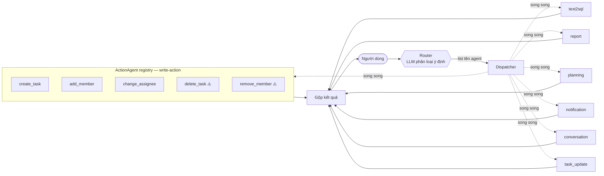
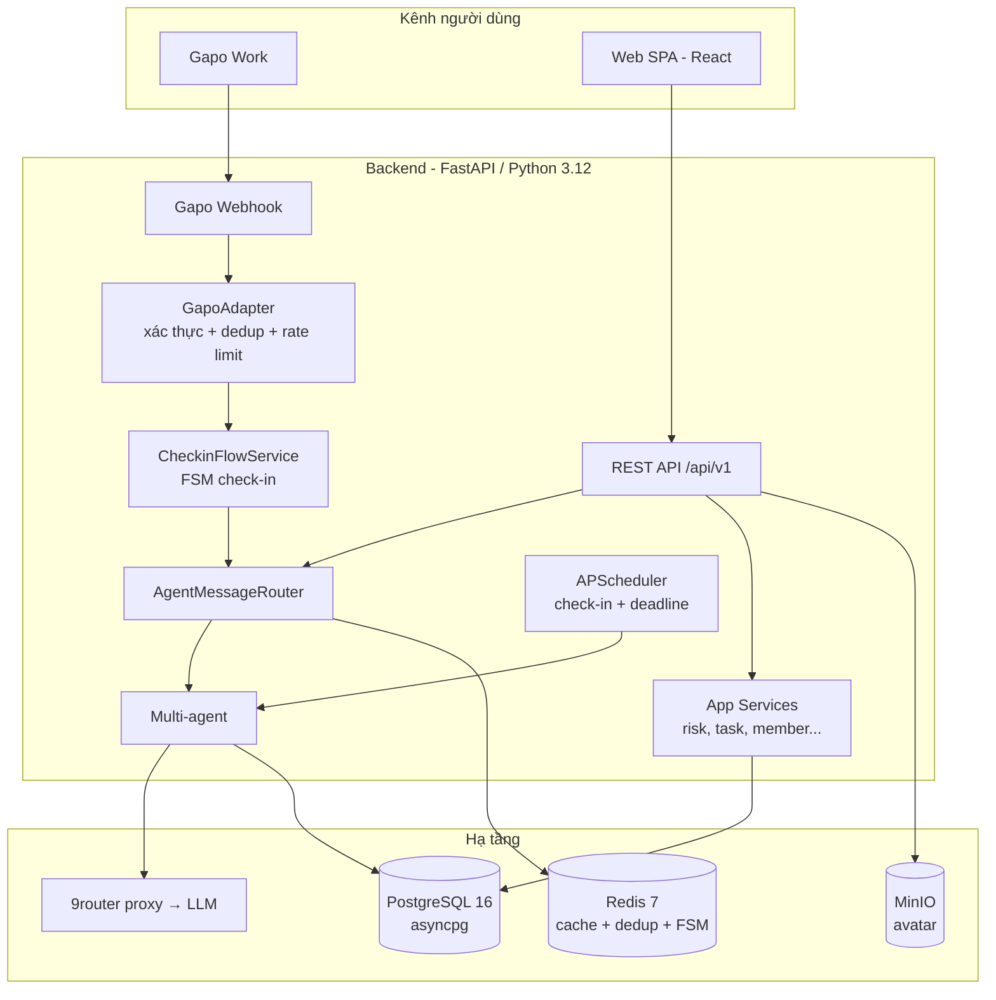
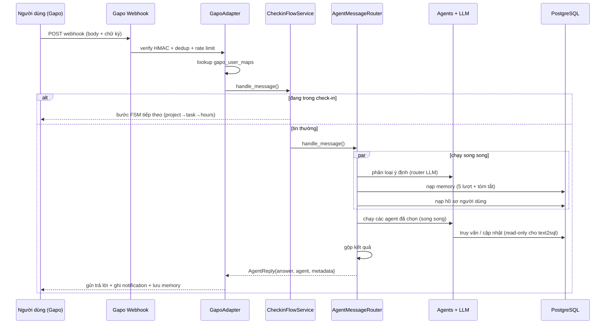

# AI Agent — PM-Bot

Trợ lý AI cho hệ thống quản lý dự án (Project Management). Người dùng trò chuyện bằng **tiếng Việt** qua Gapo (hoặc HTTP API), và bot trả lời các câu hỏi về dự án, task, worklog, tiến độ — đồng thời tự động nhắc deadline, xác minh hoàn thành công việc, giao task, thêm thành viên, và thu thập **check-in** hằng ngày.

Tài liệu này giải thích **kiến trúc**, **tại sao chọn cách làm đó**, **công nghệ sử dụng**, và **luồng dữ liệu chi tiết** từ một tin nhắn người dùng đến câu trả lời. Sơ đồ dùng [Mermaid](https://mermaid.js.org/) — GitHub render trực tiếp.

---

## Mục lục

1. [Tổng quan thiết kế: multi-agent router](#1-tổng-quan-thiết-kế-multi-agent-router)
2. [Kiến trúc hệ thống](#2-kiến-trúc-hệ-thống)
3. [Backend: API & module](#3-backend-api--module)
4. [Hệ thống AI Agent](#4-hệ-thống-ai-agent)
5. [Dịch vụ nghiệp vụ (services)](#5-dịch-vụ-nghiệp-vụ-services)
6. [Tích hợp Gapo](#6-tích-hợp-gapo)
7. [Frontend](#7-frontend)
8. [Mô hình dữ liệu](#8-mô-hình-dữ-liệu)
9. [Luồng dữ liệu: tin nhắn → câu trả lời](#9-luồng-dữ-liệu-tin-nhắn--câu-trả-lời)
10. [Công nghệ sử dụng](#10-công-nghệ-sử-dụng)
11. [Chạy dự án](#11-chạy-dự-án)
12. [Biến môi trường](#12-biến-môi-trường)

---

## 1. Tổng quan thiết kế: multi-agent router

Một câu hỏi PM có thể rất khác nhau về bản chất:

| Câu hỏi của người dùng | Cần xử lý kiểu gì | Agent |
|---|---|---|
| "Có bao nhiêu task trong dự án CRM?" | Truy vấn DB chính xác | `text2sql` |
| "Báo cáo tiến độ tuần này" | Tổng hợp nhiều truy vấn + diễn giải | `report` |
| "Giúp tôi lập kế hoạch dự án X" | Sinh nội dung có cấu trúc | `planning` |
| "Tạo thông báo nhắc deadline thứ 6" | Sinh nội dung thông báo | `notification` |
| "Tôi update task ABC xong 80% rồi" | Cập nhật task + bắt kết quả/khó khăn | `task_update` |
| "Giao task X cho Thảo deadline mai" | Tạo task mới cho người khác | `create_task` |
| "Thêm Nam vào dự án Logistics" | Gắn thành viên vào dự án | `add_member` |
| "Chào bạn" | Hội thoại tự nhiên | `conversation` |

Thay vì nhồi tất cả vào **một** prompt khổng lồ (vừa chậm, vừa khó kiểm soát, vừa dễ "ảo giác"), hệ thống chia thành **các agent chuyên biệt**, mỗi agent có prompt + logic riêng. Một **router** đứng trước phân loại ý định và trả về **một hoặc nhiều** tên agent; nếu chọn nhiều, chúng chạy **song song** rồi gộp kết quả.



> **ActionAgent registry** ([action_registry.py](backend/ai_agent/router/action_registry.py)): các write-action cùng kế thừa [ActionAgentBase](backend/ai_agent/shared/action_base.py) (gom init LLM + bóc tách + gate quyền), đăng ký vào một bảng `name → class`. Thêm tool ghi mới = thêm **1 dòng** vào registry — `VALID_AGENTS` và prompt phân loại của router tự cập nhật, không sửa router/dispatcher.
>
> Router vẫn phát **tên tool con trực tiếp** (không có tầng LLM phân loại con) nên độ trễ không đổi. `task_update` **KHÔNG** ở trong registry: nó có phiên Redis + menu nút bấm + verify service riêng nên giữ nhánh xử lý độc quyền.
>
> ⚠️ `delete_task` / `remove_member` là thao tác **phá huỷ** → đi luồng **xác nhận 2 bước**: lượt 1 trả nút "Xác nhận / Huỷ" (payload `ACTDEL|kind|id`), lượt 2 mới thực thi xoá (kiểm quyền lại). Cơ chế dùng chung bảng `_PAYLOAD_GATES`.

**Lợi ích của hướng này:**
- **Prompt nhỏ, tập trung** → chất lượng cao hơn, ít lệch hơn so với một prompt "vạn năng".
- **Cô lập rủi ro** → agent `text2sql` có lớp kiểm tra an toàn SQL riêng; agent khác không cần.
- **Dễ test & thay thế** → mỗi agent là một class độc lập, có file test riêng trong [test/](backend/ai_agent/test/).
- **LLM-agnostic** → mọi agent (kể cả router) đọc model/endpoint từ biến môi trường, nên đổi nhà cung cấp LLM chỉ là đổi `.env`.

> Router **không** dùng điểm tin cậy (confidence). Nó yêu cầu LLM trả về **mảng tên agent** dưới dạng structured output; mọi tên không thuộc tập hợp lệ đều bị loại. Khi LLM chỉ trả về `["conversation"]`, một lưới từ khoá tiếng Việt (`_keyword_agent`) đóng vai trò lưới an toàn để bắt các ý định rõ ràng bị bỏ sót.

---

## 2. Kiến trúc hệ thống



Backend là một ứng dụng **FastAPI async** (entry [backend/main.py](backend/main.py), prefix `/api/v1`). Tất cả I/O — truy vấn DB, gọi LLM, gửi tin Gapo — đều `async/await` để tận dụng concurrency cho hệ thống nặng I/O.

---

## 3. Backend: API & module

Mỗi module trong [backend/app/modules/](backend/app/modules/) có một `router.py` (APIRouter) cùng models/services hỗ trợ, được gắn vào app dưới prefix `/api/v1`.

| Module | Vai trò |
|---|---|
| [auth](backend/app/modules/auth/) | Đăng nhập JWT, refresh/logout token |
| [users](backend/app/modules/users/) | Hồ sơ người dùng, tuỳ chọn cá nhân |
| [projects](backend/app/modules/projects/) | CRUD dự án, lọc, metadata |
| [tasks](backend/app/modules/tasks/) | Vòng đời task: tạo, chuyển trạng thái, blocker, phụ thuộc, import |
| [milestones](backend/app/modules/milestones/) | Giai đoạn dự án, % hoàn thành |
| [worklogs](backend/app/modules/worklogs/) | Ghi nhận giờ làm việc theo ngày/người/task |
| [backlogs](backend/app/modules/backlogs/) | Hàng đợi worklog chờ duyệt |
| [members](backend/app/modules/members/) | Thành viên & vai trò trong dự án |
| [tags](backend/app/modules/tags/) | Nhãn cho task |
| [scopes](backend/app/modules/scopes/) | Phạm vi / ước lượng dự án |
| [dashboard](backend/app/modules/dashboard/) | Số liệu tổng quan, thống kê team |
| [notifications](backend/app/modules/notifications/) | Thông báo in-app (chuông + trang) |
| [agent](backend/app/modules/agent/) | Cổng vào AI agent (`POST /agent/message`), trạng thái check-in, backlog |
| [agent_audit](backend/app/modules/agent_audit/) | Nhật ký hành động của agent |
| [admin](backend/app/modules/admin/) | Quản trị người dùng, cấu hình công ty |
| [uploads](backend/app/modules/uploads/) | Upload avatar (MinIO) |
| [customers](backend/app/modules/customers/) · [rates](backend/app/modules/rates/) · [meetings](backend/app/modules/meetings/) | Khách hàng, đơn giá, lịch họp |

**Truy cập DB** ([backend/database.py](backend/database.py)): SQLAlchemy async + `asyncpg` tới **PostgreSQL 16**. Pool cấu hình qua env (`DB_POOL_SIZE`, `DB_MAX_OVERFLOW`, `DB_POOL_RECYCLE`, `DB_POOL_TIMEOUT`) với fail-fast khi cạn kết nối.

---

## 4. Hệ thống AI Agent

Mã nguồn: [backend/ai_agent/](backend/ai_agent/). Xem thêm [DESIGN.md](backend/ai_agent/DESIGN.md).

### 4.1 Router & dispatcher

- **[router/router.py](backend/ai_agent/router/router.py)** (`PMMultiAgentRouter`): phân loại ý định bằng LLM (model nhẹ qua `ROUTER_MODEL_NAME`, fail-fast `timeout=10s`), trả về mảng tên agent từ `VALID_AGENTS = READ_AGENTS ∪ ACTION_NAMES`. Các agent đọc/soạn cố định: `report, text2sql, planning, conversation, notification, task_update`; các write-action lấy từ [ActionAgent registry](backend/ai_agent/router/action_registry.py): `create_task, add_member, change_assignee, delete_task, remove_member`. Phần mô tả write-action trong prompt phân loại **sinh tự động** từ `intent_desc` của mỗi service.
- **[router/message_router.py](backend/ai_agent/router/message_router.py)** (`AgentMessageRouter`): điều phối chính. Trong `handle_message()` nó chạy **song song** (`asyncio.gather`): chọn agent + nạp bộ nhớ hội thoại (5 lượt gần nhất + tóm tắt) + nạp hồ sơ người dùng (tên, phòng ban, số task quá hạn, deadline gần nhất, dự án). Sau đó chạy các agent đã chọn song song và gộp kết quả: 1 agent → trả prose trực tiếp; ≥2 agent → nối các đoạn (không gọi lại LLM, không gắn nhãn).

### 4.2 Các agent chuyên biệt

| Agent | File | Mô tả |
|---|---|---|
| **text2sql** | [text_to_sql/text2sql.py](backend/ai_agent/text_to_sql/text2sql.py) | NL → SQL → tóm tắt. Cache SQL + cache kết quả (Redis). Lớp an toàn `is_safe_sql`: chỉ `SELECT`/`WITH`, chặn mọi mutation và hàm nguy hiểm. Chạy qua **role DB read-only** riêng (`DB_AGENT_USER`) với statement timeout. |
| **report** | [report_generator/report_agent.py](backend/ai_agent/report_generator/report_agent.py) | Ưu tiên template SQL dựng sẵn (`project_progress`, `period_progress`, `overdue_upcoming`, `workload_by_person`); fallback lập kế hoạch truy vấn động. Dùng structured output. |
| **planning** | [planning/planning_agent.py](backend/ai_agent/planning/planning_agent.py) | Sinh `ProjectPlan` có cấu trúc (Pydantic, ép `function_calling`). |
| **conversation** | [coversation/conversation.py](backend/ai_agent/coversation/conversation.py) | Chào hỏi, trợ giúp, hỏi đáp chung; temperature cao hơn. |
| **notification** | [notification/notification_agent.py](backend/ai_agent/notification/notification_agent.py) | Sinh nội dung nhắc deadline; có template fallback (thông báo không được "im lặng"). |
| **task_update** | [task_update/](backend/ai_agent/task_update/) | Khi người dùng khẳng định đã làm xong/cập nhật một task; bắt **kết quả/khó khăn** và lưu vào task. |

**Write-action** (kế thừa [ActionAgentBase](backend/ai_agent/shared/action_base.py), đăng ký trong [action_registry.py](backend/ai_agent/router/action_registry.py)):

| Action | File | Mô tả | Confirm? |
|---|---|---|:-:|
| **create_task** | [task_create_service.py](backend/app/services/task_create_service.py) | Giao việc / tạo task mới cho người khác. | — |
| **add_member** | [add_member_service.py](backend/app/services/add_member_service.py) | Thêm thành viên vào dự án. | — |
| **change_assignee** | [change_assignee_service.py](backend/app/services/change_assignee_service.py) | Giao lại task đã có cho người khác; báo cho người nhận mới + quét lại rủi ro dự án. | — |
| **delete_task** | [delete_task_service.py](backend/app/services/delete_task_service.py) | Xoá task (giảm `task_count`, đồng bộ milestone). | ✅ 2 bước |
| **remove_member** | [remove_member_service.py](backend/app/services/remove_member_service.py) | Gỡ thành viên khỏi dự án (giảm `member_count`). | ✅ 2 bước |

> Mọi write-action: **chỉ MANAGER/ADMIN/SUPER_ADMIN** (gate `is_privileged` ở `ActionAgentBase.run`, kiểm lại ở bước thực thi với tool có confirm); resolve người/dự án/task mơ hồ → **hỏi lại, không đoán** ([shared/entity_resolver.py](backend/ai_agent/shared/entity_resolver.py): `resolve_users`/`resolve_projects`/`resolve_tasks`). `resolve_tasks` nhận mã task Jira-style (`GAP-T0003`) lẫn dạng số (`[3.2]`), giới hạn trong các dự án người gọi có quyền.

### 4.3 Hạ tầng agent

- **[shared/llm_factory.py](backend/ai_agent/shared/llm_factory.py)** — `make_llm()` thống nhất, tạo `ChatOpenAI` (LangChain) trỏ về proxy **9router** (tương thích OpenAI API). Đổi model/nhà cung cấp = đổi `.env`. Dùng `with_structured_output(method="function_calling")` cho structured output (json_mode fail qua proxy).
- **[memory/memory.py](backend/ai_agent/memory/memory.py)** — bảng `agent_memory`; nạp 5 lượt gần nhất + tóm tắt; mỗi 4 lượt nén lịch sử bằng LLM để chống "phình" context.
- **[context/](backend/ai_agent/context/)** — phân giải đại từ/tên → entity thật (user/project/task).
- **[checkin/](backend/ai_agent/checkin/)** — `CheckinFlowService` chặn tin nhắn **trước** router; FSM: `IDLE → AWAITING_PROJECT → AWAITING_TASK → AWAITING_HOURS → CONFIRMING → COMPLETED/CANCELLED`. Scheduler (APScheduler) kích hoạt 11:50 & 17:50 giờ VN; `WorklogParserService` trích số giờ từ ngôn ngữ tự nhiên.

---

## 5. Dịch vụ nghiệp vụ (services)

[backend/app/services/](backend/app/services/) — logic dùng chung giữa REST API và agent:

| Service | Vai trò |
|---|---|
| [task_create_service.py](backend/app/services/task_create_service.py) | Tạo task + auto-assign + thông báo |
| [task_progress_service.py](backend/app/services/task_progress_service.py) | Cập nhật %, trạng thái, ước lượng; kích hoạt thông báo |
| [task_outcome_service.py](backend/app/services/task_outcome_service.py) | Đóng task, xác minh kết quả |
| [task_assignment_notifier.py](backend/app/services/task_assignment_notifier.py) | Báo khi được giao task |
| [add_member_service.py](backend/app/services/add_member_service.py) | Thêm người vào dự án (resolve tên → user) |
| [dependency_service.py](backend/app/services/dependency_service.py) | Kiểm tra phụ thuộc task & phát hiện chu trình |
| [risk_detector.py](backend/app/services/risk_detector.py) | Chấm điểm rủi ro: trễ hạn, độ nặng blocker, quá hạn |
| [risk_alert_service.py](backend/app/services/risk_alert_service.py) | Phát cảnh báo rủi ro/chậm tiến độ |
| [outbound_message_service.py](backend/app/services/outbound_message_service.py) | Gửi DM cho người thứ ba (resolve tên → gửi qua Gapo) |

---

## 6. Tích hợp Gapo

[Gapo Work](https://gapowork.vn) là nền tảng chat doanh nghiệp — kênh chính người dùng nhắn với bot. [backend/gapo/](backend/gapo/):

- **gapo_webhook.py** — route nhận webhook (ngoài `/api/v1`).
- **gapo_adapter.py** (`GapoAdapter`) — xác thực chữ ký HMAC-SHA256 (`GAPO_WEBHOOK_SECRET`), **dedup hai lớp** (Redis + LRU in-process) theo `message_id`, **rate limit** theo user, ánh xạ người gửi qua bảng `gapo_user_maps`, rồi đẩy qua check-in → router; gửi trả lời về Gapo + ghi audit.
- **gapo_client.py** / **gapo_schema.py** — HTTP client gửi tin & Pydantic schema cho payload.

> Webhook vào qua router NAT WAN:3637 → host:8000 (**không** qua nginx). Backend phải publish `8000:8000` nếu không inbound bị drop im lặng.

---

## 7. Frontend

SPA React + TypeScript trong [frontend/](frontend/), build bằng **Vite**.

**Stack:** React 18 · React Router 6 · TanStack React Query 5 (server state) · Zustand 5 (global state) · React Hook Form 7 + Zod 3 · Tailwind CSS 3 · Recharts · i18next · Lucide icons.

**Cấu trúc** [frontend/src/](frontend/src/):
- `app/` — providers, định nghĩa route
- `pages/` — trang theo route (dashboard, login, projects, tasks, tags, worklogs, profile, notifications, settings)
- `features/` — module nghiệp vụ kèm gọi API (auth, projects, tasks, worklogs, chat, notifications, agent-audit, ...)
- `components/` — `AppShell` + `ui/` tái sử dụng
- `lib/`, `i18n/`, `shared/schemas/`, `test/`

Tính năng **chat** (`features/chat/`) có ô nhập tin, slash command + autocomplete.

---

## 8. Mô hình dữ liệu

PostgreSQL 16; schema khởi tạo từ các script trong [init/](init/) (chạy theo thứ tự khi container DB lần đầu lên): `init.sql` (core) · `seed.sql` (demo) · `agent_role.sql` (role read-only) · `notifications.sql` · `gapo_link_codes.sql` · `agent_features.sql` · `tags.sql` · `deadline_quickactions.sql` · `entity_codes*.sql` · `task_dependencies.sql` · `checkin_edit_worklog.sql` · `followup_kind.sql`. Sơ đồ tổng quan: [schema.dbml](schema.dbml).

**Entity chính:** `users`, `companies`, `projects`, `tasks`, `milestones`, `worklogs`, `backlogs`, `members`, `tags`, `task_blockers`, `task_dependencies`, `notifications`, `gapo_user_maps`, `channel_identities`, `checkin_sessions`, `agent_memory`, `agent_audit_log`, `project_counters`, `refresh_tokens`.

**Mã entity (Jira-style):** mỗi dự án có `code` (vd `MTL`); task = `MTL-T001`, milestone = `MTL-M001`, cấp tuần tự per-project qua bảng `project_counters` và helper [core/code_gen.py](backend/core/code_gen.py). Mọi INSERT task/milestone phải sinh mã.

**Phụ thuộc task:** quan hệ A→B (`task_dependencies`), người dùng đặt thủ công, agent quét cảnh báo mềm — khác với `task_blockers`.

---

## 9. Luồng dữ liệu: tin nhắn → câu trả lời



---

## 10. Công nghệ sử dụng

| Lớp | Công nghệ |
|---|---|
| Backend | Python 3.12 · FastAPI · SQLAlchemy 2 (async) · asyncpg |
| AI/LLM | LangChain · `ChatOpenAI` qua proxy **9router** (mặc định Google Gemini) · Pydantic structured output |
| CSDL | PostgreSQL 16 |
| Cache / state | Redis 7 (cache SQL, dedup webhook, FSM check-in) |
| Lập lịch | APScheduler (check-in 11:50/17:50, nhắc deadline) |
| Lưu file | MinIO (S3-compatible, avatar) |
| Auth | JWT |
| Frontend | React 18 · TypeScript · Vite · React Query · Zustand · Tailwind |
| Triển khai | Docker Compose |

---

## 11. Chạy dự án

### Docker Compose (khuyến nghị)

```bash
cp .env.example .env          # rồi sửa các secret bên dưới
docker compose up -d
```

Dịch vụ ([docker-compose.yml](docker-compose.yml)):

| Service | Cổng | Vai trò |
|---|---|---|
| `backend` | `8000:8000` | REST API + webhook |
| `frontend` | `8090:80` (hoặc `FE_PORT`) | React SPA (Nginx) |
| `db` | `127.0.0.1:5432` | PostgreSQL 16 (chỉ host) |
| `redis` | nội bộ | cache / dedup / FSM |
| `9router` | nội bộ | proxy LLM |
| `minio` (+ `minio-init`) | `9000:9000` | object storage avatar |

- Backend: http://localhost:8000 · API docs: http://localhost:8000/docs
- Frontend: http://localhost:8090

### Chạy thủ công (dev)

```bash
# Backend (cần Postgres + Redis sẵn)
cd backend && pip install -r requirements.txt && uvicorn main:app --reload

# Frontend
cd frontend && npm install && npm run dev
```

### Test

```bash
cd backend && pytest ai_agent/test/    # test agent
cd frontend && npm test                # Vitest
```

---

## 12. Biến môi trường

Sao chép [.env.example](.env.example) → `.env`. Các nhóm chính:

| Nhóm | Biến tiêu biểu |
|---|---|
| Bảo mật | `JWT_SECRET`, `CORS_ORIGIN`, `AGENT_API_TOKEN` |
| DB pool | `DB_POOL_SIZE`, `DB_MAX_OVERFLOW`, `DB_POOL_RECYCLE`, `DB_POOL_TIMEOUT` |
| Rate limit | `RATE_LIMIT_AGENT(_WINDOW)`, `RATE_LIMIT_LOGIN(_WINDOW)` |
| LLM | `LLM_PROVIDER`, `NINE_ROUTER_BASE_URL`, `NINE_ROUTER_MODEL`, `ROUTER_MODEL_NAME`, `API_KEY`/`BASE_URL`/`MODEL_NAME` |
| Agent DB read-only | `DB_AGENT_USER`, `DB_AGENT_PASSWORD`, `AGENT_STATEMENT_TIMEOUT_MS` |
| Gapo | `GAPO_API_URL`, `GAPO_BOT_TOKEN`, `GAPO_BOT_ID`, `GAPO_SEND_TOKEN`, `GAPO_DRY_RUN`, `GAPO_WEBHOOK_SECRET`, `GAPO_SIGNATURE_HEADER` |
| MinIO | `MINIO_ROOT_USER`, `MINIO_ROOT_PASSWORD`, `MINIO_BUCKET`, `MINIO_PUBLIC_URL` |
| Check-in / nhắc | `CHECKIN_SCHEDULER_ENABLED`, `DEADLINE_NOTIFY_HOUR`, `DEADLINE_NOTIFY_MINUTE` |

> **Trước khi lên production:** đổi tất cả `change-me*`, đặt `GAPO_DRY_RUN=false`, set `GAPO_WEBHOOK_SECRET`, dùng `DB_AGENT_USER` read-only riêng (không fallback về `DB_USER`).
