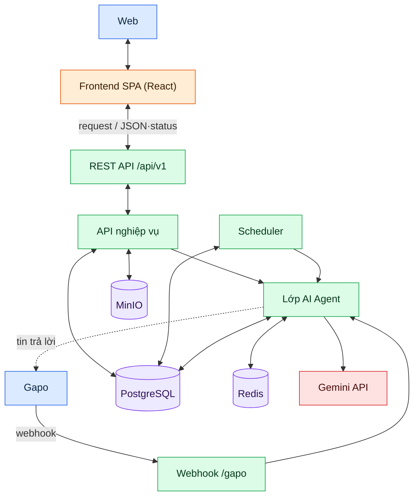
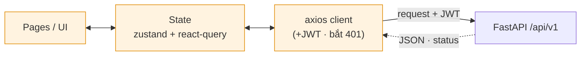
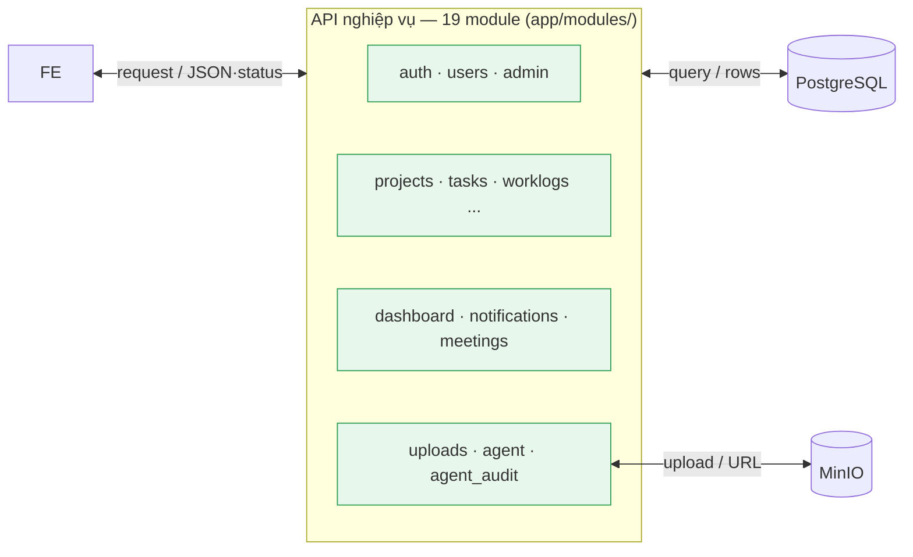
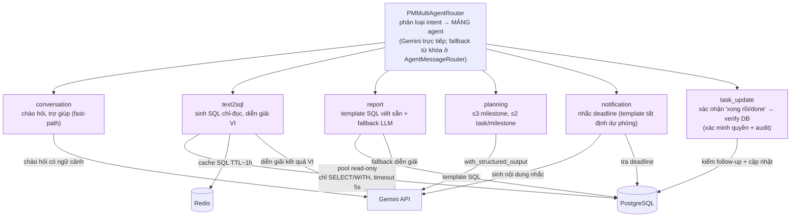
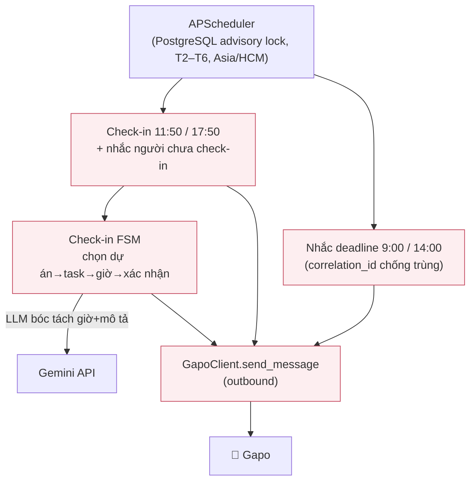

# Kiến Trúc Hệ Thống Agent-PM (Full: Frontend → Backend → Agent)

> Sơ đồ dựng từ code thực tế: `frontend/`, `backend/app/modules/`, `backend/ai_agent/`, `backend/gapo/`, `docker-compose.yml`.

---

## 1. Sơ đồ tổng thể (container / service)



**Ghi chú đường mạng quan trọng:**
- FE gọi BE qua `/api/v1` (axios + JWT trong header).
- Webhook Gapo vào **thẳng backend:8000** qua router NAT (WAN 3637) — **không qua nginx**; backend phải publish cổng 8000.
- Toàn bộ lời gọi LLM đi tới **Gemini API**. Các agent đọc cấu hình từ env (`MODEL_NAME`/`BASE_URL`/`API_KEY`); riêng intent router (`PMMultiAgentRouter`) **hardcode** model + key trong source — xem mục 4.2.

---

## 2. Frontend (chi tiết)



**Luồng phản hồi quay lại (FE):**
- **Thành công:** response JSON → react-query ghi vào cache → component re-render. Mutation thành công thì `invalidateQueries` để đồng bộ lại.
- **401 Unauthorized:** response interceptor ([apiClient.ts:20-31](../frontend/src/lib/apiClient.ts#L20-L31)) gọi `useAuth.clear()` rồi `window.location.assign("/login")` (chỉ khi đang có token, tránh vòng lặp tại trang login).
- **Lỗi khác (4xx/5xx):** `Promise.reject(error)` → component/`onError` của react-query hiển thị thông báo.
- **Polling chủ động (server → UI một chiều logic):** `NotificationBell` & `AgentAuditPage` đặt `refetchInterval: 30_000` ([NotificationBell.tsx:25](../frontend/src/components/NotificationBell.tsx#L25)) — cứ 30s tự gọi lại API để kéo dữ liệu mới (FR-11), không cần WebSocket.
- **Kanban kéo-thả + bảng** cho Projects/Tasks; optimistic update qua react-query (cập nhật cache ngay, rollback nếu response lỗi).

---

## 3. API nghiệp vụ (19 module REST)



- **Chiều phản hồi:** module trả Pydantic model → FastAPI serialize JSON + status; lỗi nghiệp vụ ném `HTTPException` → client nhận status + `detail`.

- Auth: JWT (`user_id, email, role`); service-to-service cho agent qua header `X-Agent-Token`.
- Phân quyền 2 lớp: theo **vai trò** (ADMIN/MANAGER/MEMBER/VIEWER) và theo **membership dự án**.

---

## 4. Lớp AI Agent — luồng xử lý 1 tin nhắn Gapo

### 4.1. Các điểm gác (gate) trong `GapoAdapter.handle_event` — TRƯỚC khi vào router

> Một tin nhắn phải vượt qua **6 cửa kiểm tra tuần tự** trong [gapo_adapter.py](../backend/gapo/gapo_adapter.py). Mỗi cửa có thể trả lời ngay và **dừng luồng** — chỉ tin nào lọt hết mới tới `AgentMessageRouter`. Đây là phần luồng quan trọng nhất và là nơi sinh ra các hành vi "lệnh không nhận diện" / "tin bị nuốt".

```mermaid
flowchart TB
    START["POST /webhook/gapo<br/>GapoAdapter.handle_event"] --> G0

    G0{"verify_signature<br/>HMAC-SHA256?"}
    G0 -->|sai chữ ký| R0["❌ invalid_signature"]
    G0 -->|hợp lệ / dev| G1

    G1{"event == message_created<br/>& có message?"}
    G1 -->|thread_created / khác| R1["⏭️ ignored"]
    G1 -->|ok| G2

    G2{"_extract_user_text<br/>có nội dung text?"}
    G2 -->|rỗng (sticker/ảnh/<br/>attachment)| R2["💬 'Mình chưa đọc được<br/>nội dung tin nhắn này.'"]
    G2 -->|có text| G3

    G3{"message_type ∈<br/>text/quick_reply/menu?"}
    G3 -->|loại khác| R3["💬 'Chỉ hỗ trợ tin nhắn văn bản.'"]
    G3 -->|ok| G4

    G4{"text bắt đầu '/link'?"}
    G4 -->|có| R4["🔗 _handle_link_command<br/>(tự liên kết tài khoản)"]
    G4 -->|không| G5

    G5{"_lookup_gapo_user<br/>đã map & active?"}
    G5 -->|chưa map| R5["🚫 'Tài khoản chưa được<br/>liên kết với hệ thống.'"]
    G5 -->|đã map| CK

    CK["CheckinFlowService.handle_message<br/>(chặn trước router)"]
    CK --> CKD{"trả về?"}
    CKD -->|str ≠ ''| RCK["✅ gửi reply check-in"]
    CKD -->|'' (đã gửi menu)| RCK2["✅ đã gửi qua send_menu"]
    CKD -->|None (không liên quan)| RT["➡️ AgentMessageRouter.handle_message"]

    classDef gate fill:#fff7e6,stroke:#d48806,color:#5c3a00;
    classDef stop fill:#fff1f0,stroke:#cf1322,color:#5c0011;
    classDef pass fill:#f6ffed,stroke:#389e0d,color:#135200;
    class G0,G1,G2,G3,G4,G5,CKD gate;
    class R0,R1,R2,R3,R5 stop;
    class R4,RCK,RCK2,RT,CK pass;
```

**⚠️ Hai điểm dễ gây bug đã xác nhận trong code:**
- **Checkin chặn trước router** ([gapo_adapter.py:185-194](../backend/gapo/gapo_adapter.py#L185-L194)): nếu user còn 1 *active check-in session*, MỌI tin (kể cả "cook") bị diễn giải thành thao tác trong flow check-in → không tới được agent LLM.
- **`/checkin` neo `$`** trong `CHECKIN_TRIGGER` ([constants.py:5](../backend/ai_agent/checkin/constants.py#L5)) — `^/?(checkin|check[\s\-]?in)$`: gõ thừa chữ ("/checkin đi") **không khớp** → lệnh không kích hoạt, rơi xuống LLM và bị "bịa" trả lời.

### 4.2. Bên trong `AgentMessageRouter` — phân loại, chạy song song, gộp

```mermaid
sequenceDiagram
    participant AD as GapoAdapter
    participant RT as AgentMessageRouter
    participant IR as PMMultiAgentRouter<br/>(intent · Gemini)
    participant MEM as Memory
    participant PRF as Profile
    participant AG as Agents (song song)
    participant L9 as Gemini API (qua env)
    participant DB as PostgreSQL
    participant GMNI as Gemini API (trực tiếp)

    AD->>RT: handle_message(message, user_id, conv_id, db)

    par Nạp song song (asyncio.gather — giảm trễ)
        RT->>IR: selected_agents(text)
        IR->>GMNI: classify intent (reasoning_effort=none)
        GMNI-->>IR: ["text2sql","report",...]
        IR-->>RT: list tên agent (đã validate VALID_AGENTS)
    and
        RT->>MEM: load_memory (≤5 lượt + tóm tắt)
    and
        RT->>PRF: load_user_profile (tên, role, dự án, task quá hạn)
    end

    RT->>RT: _fallback_agent_for_message<br/>(ép task_update nếu 'xong rồi/done';<br/>cứu intent bằng từ khoá nếu LLM = ['conversation'];<br/>loại 'conversation' thừa khi có agent nghiệp vụ)

    RT->>AG: asyncio.gather(return_exceptions=True)<br/>chạy mọi agent đã chọn
    Note over AG,L9: report/planning/notification/<br/>conversation/task_update → Gemini (env)
    Note over AG,DB: text2sql/report/task_update → pool read-only<br/>(DB_AGENT_USER, chỉ SELECT/WITH, timeout 5s)
    AG-->>RT: kết quả từng agent (lỗi 1 agent không làm hỏng reply)

    RT->>RT: _combine_results<br/>(1 agent → trả thẳng; ≥2 → nối bằng dòng trống,<br/>KHÔNG gọi LLM lần nữa)
    RT-->>AD: AgentReply(answer, agent="text2sql+report", metadata)

    AD->>DB: save_memory (nếu agent ≠ 'error')
    AD-->>AD: send_text_with_response_time → Gapo
```

**Lưu ý:** mọi agent đều gọi **Gemini API**. Khác biệt là các agent nghiệp vụ đọc `MODEL_NAME`/`BASE_URL`/`API_KEY` từ **env**, còn intent router (`PMMultiAgentRouter`) **hardcode** `gemini-2.5-flash` + base_url + **API key ngay trong source** ([router.py:38-46](../backend/ai_agent/router/router.py#L38-L46)). ⚠️ Cần đưa key này về env.

### Các agent chuyên biệt



> Lưu ý cấu hình LLM: tất cả agent gọi **Gemini API**. 6 agent nghiệp vụ lấy model/key từ **env** (đổi model 1 chỗ); riêng **intent router** đang **hardcode** model + API key trong source — nên đưa về env trong lần refactor tới.

---

## 5. Scheduler & tích hợp Gapo outbound



---

## 6. Tóm tắt tầng lưu trữ & bảo mật

| Thành phần | Vai trò | Bảo mật |
|---|---|---|
| **PostgreSQL 16** | Dữ liệu chính + `agent_memory`, `agent_audit_log` | App dùng pool thường; **agent dùng role read-only riêng** (`DB_AGENT_USER`) |
| **Redis 7** | Cache SQL sinh ra (TTL ~1h), state | bỏ cache cho câu hỏi thời gian tương đối |
| **MinIO (S3)** | Ảnh avatar / upload | giới hạn loại + 2MB |
| **Gemini API** | LLM cho mọi agent | cấu hình qua env (intent router còn hardcode — cần sửa) |
| **JWT** | Auth user | bcrypt password; endpoint nghiệp vụ cần token |
| **HMAC-SHA256** | Xác thực webhook Gapo | `GAPO_WEBHOOK_SECRET` |
| **X-Agent-Token** | Service-to-service (agent → API) | — |

---

## 7. Phần kiến trúc CHƯA có (gap so với requirement)

> 2 mảnh của sơ đồ luồng 4 giai đoạn chưa nằm trong kiến trúc hiện tại — xem [timeline-cai-tien-1-tuan.md](timeline-cai-tien-1-tuan.md):

- **FR-17 (Giai đoạn 1 — Giao việc):** chưa có nhánh `tạo task → assignment_notifier → Gapo DM/thread`.
- **FR-18 (Giai đoạn 4 — Rủi ro):** chưa có `risk_scanner job → risk_alerts → PM duyệt (human-in-the-loop) → push`.

```mermaid
flowchart LR
    NT["create_task / materialize plan"] -.->|FR-17 (chưa có)| NOTI["assignment_notifier → Gapo"]
    RS["risk_scanner job"] -.->|FR-18 (chưa có)| RA["risk_alerts (PENDING)"] -.->|PM duyệt| PUSH["push/đổi trạng thái"]
    classDef gap fill:#fff,stroke:#c44,stroke-dasharray:5 5;
    class NT,NOTI,RS,RA,PUSH gap;
```
